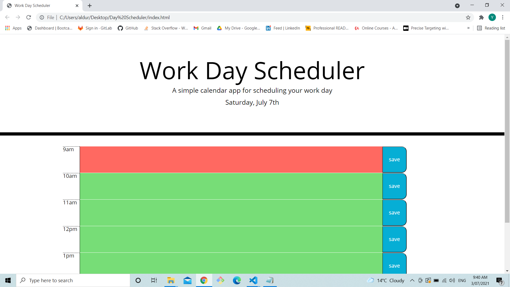

# 05 Third-Party APIs: Work Day Scheduler

## Our Task
In this week's task we were given a starter code to add and edit. The basic layout of the html and the css were given. few elements and a javascript had to be add for the code to function

## URL

https://seaweedq12.github.io/Day-Scheduler/

## Work

1. when the page is loaded a textarea with times form 9am to 3pm with a hour interval pops up. past time will have a grey background, the current time will have a red background and the future time with a green background. 

The time I took this picture was around 9:40am

2. Also when the user types a text and clicks the save button corresponding to the textbox the text is save into the local storage.

3. In this work couldn't make alot of commits due to making the code in single session